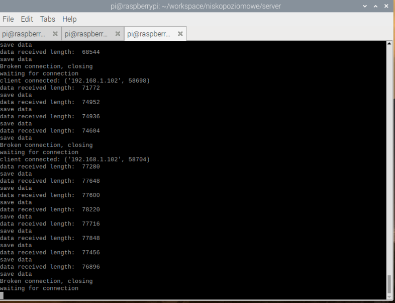

## Projekt programowanie niskopoziomowe - aplikacja wykrywająca włamywacza na kamerze i wysyłająca zdjęcia na serwer oraz wyświetlająca je na stronie internetowej.

## Działanie w skrócie: 
Aplikacja c++ zbiera w czasie rzeczywistym obrazy z kamery. Dla każdego obrazu sprawdza (za pomocą modelu tensorflow), czy jest na nim włamywacz. Jeśli jest, to wysyła zdjęcie na serwer tcp, napisany w Pythonie postawiony na raspberryPi, który zapisuje zdjęcia na dysku raspberry.  Dodatkowo na raspberryPi działa server Apache oraz stworzona jest strona internetowa dzięki której można podlądać zapisane zdjęcia. 

## Plan działania

- Wytrenowanie modelu tensorflow rozpozającego włamywacza. 
- Stworzenie aplikacji w c++, która będzie:
  - zbierać zdjęcia z kamery.
  - sprawdzać czy jest na nich włamywacz za pomocą modelu tensorflow.
  - Wysyłać pozytywnie przewidziane zdjęcia. (Klient tcp)
- Stworzenie komunikacji tcp między aplikacją c++ oraz aplikacją na raspberryPi w tej samej lokalnej sieci. (Przesyłanie zdjęć)
- Stworzenie aplikacji w pythonie na raspberryPi która będzie: 
  - Odbierać zdjęcia.(Serwer tcp)
  - Zapisywać zdjęcia na dysku.
- Stworzenie serwera www na raspberryPi oraz strony internetowej na której będą wyświetlać się zdjęcia 

## 1. Wytrenowanie modelu tensorflow rozpozającego włamywacza. 
Zebrany został zbiór danych oraz wrzucony do usługi Azure Custom Vision.

Zbiór danych składa się ze zdjęć które przedstawiają włamywacza (good) oraz takich które go nie przedstawiają (bad)

Bad: 

Good: 

Nastepnie model został wytrenowany oraz pobrany na dysk

Kolejnym krokiem było zapisanie modelu w odpowiednim folderze aby aplikacja c++ mogła z niego korzystać. 

## 2. Stworzenie aplikacji w C++

Kod źródłowy aplikacji c++ znajduje się w głównym katalogu w pliku main2.cpp. W trakcie uruchamiania kompilowany jest także plik Utils.cpp. Jest to plik zawierający funkcje które są pomocne przy działaniu modelu tensorflow.

Funkcja main: 
- Łączy się poprzez tcp z serwerem (raspberryPi w sieci lokalnej)
- konfiguruje tensorflowa co sprowadza się do wczytania grafu i stworzenia wejściowych i wyjściowych tensorów.
- Łączy się z kamerą korzystając z OpenCv. 
- Wchodzi w pętlę która zbiera zdjęcia z kamery, wyświetla je i przewiduje każde z nich na podstawie wyżej skonfigurowanego modelu tensorflow. Jeśli zdjęcie zostanie przewidziane jako good (czyli włamywacz jest na zdjęciu), zostaje ono wysłane na serwer. 

Próba zbierania obrazu z kamerki IP w sieci lokalnej zakończyła się powodzeniem ale były na tyle duże "lagi" że w dalszej części używam tylko kamerki z laptopa. Lagi mogą wynikać z tego, że kamerka podłączona jest do sieci przez wifi więc transfer może być niestabilny.  

## 3. Komunikacja między aplikacją w c++ na komputerze a serwerem na raspberryPi:

Aby przesłać zdjęcia korzystam z kodowania ich za pomocą base64. Za kodowanie po stronie c++ odpowiada funkcja base64_encode. Na serwerze gdzie korzystam z pythona funkcja do dekodowania jest zaimplementowana w paczce o nazwie base64.

Zdjęcia przesyłane są partiami po 1024 bajty.

## 4. Aplikacja na raspberryPi (server):

Kod źródłowy znajduje się w folderze "server".

Serwer został zaimplementowany w języku Python.

Serwer odpowiada za odbieranie zdjęć partiami po 1024 bajty, łączenie ich w całość oraz dekodowanie z base64 a następnie zapisanie ich na dysku w folderze /var/www/html/photos.

## 5. Strona internetowa wyświetlająca zdjęcia włamywacza:

- Postawienie serwera Apache na raspberryPi: 

aby postawić serwer korzystałem z tego tutoriala:
https://www.raspberrypi.org/documentation/remote-access/web-server/apache.md

- Stworzenie aplikacji w jezyku php która wyświetla zdjęcia na stronie.

Kod źódłowy znajduje się w folderze php-server.
W systemie powyższy folder znajduje się w katalogu /var/www.
W powyszym katalogu znajduje się folder html/photos. To właśnie tutaj zapisywane są zdjęcia, które serwer tcp odbiera od klienta tcp (aplikacji c++).

W kodzie php został użyty "ajax" czyli asynchroniczne zapytania które mają na celu wczytanie coraz większej ilości zdjęć włamywacza bez konieczności przeładowywania strony. 

Dzięki temu, że mam publiczne ip. Otwierając port 80 byłem w stanie stronę upublicznić w sieci i mieć wgląd w nowe zdjęcia włamywacza nawet z poza sieci lokalnej. 

## 6. Działanie systemu (gify) :

Poniższe gify obrazują działanie systemu w czasie rzeczywistym: 

Aplikacja c++:

Działanie aplikacji C++.

Działanie aplikacji C++ oraz serwera na raspberryPi jednocześnie. (Do raspberry dostęp zdalny do pulpitu za pomocą VNC).

Działanie podglądu na stronie internetowej w czasie rzeczywistym.

